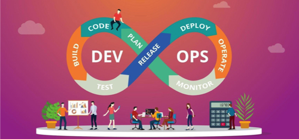

# Implantação de um Pipeline DevOps

Esse material visa apresentar a ferramenta <a href="https://www.jetbrains.com/teamcity/?source=google&medium=cpc&campaign=12704032062&gclid=Cj0KCQjwrJOMBhCZARIsAGEd4VEvmhLzrxXgIWnJJaBqSzEqfn_0Uv2Wb-uzBLFEWgfIOyCW-6GD5OEaAjL2EALw_wcB"> TeamCity</a>, cujo o objetivo é implantar um Pipeline de desenvolvimento com Continuos Integration (CI) e Continuos Delivery (CD).

> Autor: **[Luciano de Aguiar Monteiro](https://github.com/lucianoaguiarthe)**
> 
> E-mail: luciano@lucianoaguiar.com.br
> 
> Autor: **[Anderson Lima](https://github.com/lucianoaguiarthe)**
> 
> E-mail: andclima@gmail.com

## Sumário

1. [Arcabouço Teórico](manuscript/pipeline-cicd.md)
2. [Pipeline de Desenvolvimento](manuscript/pipeline-cicd.md)
