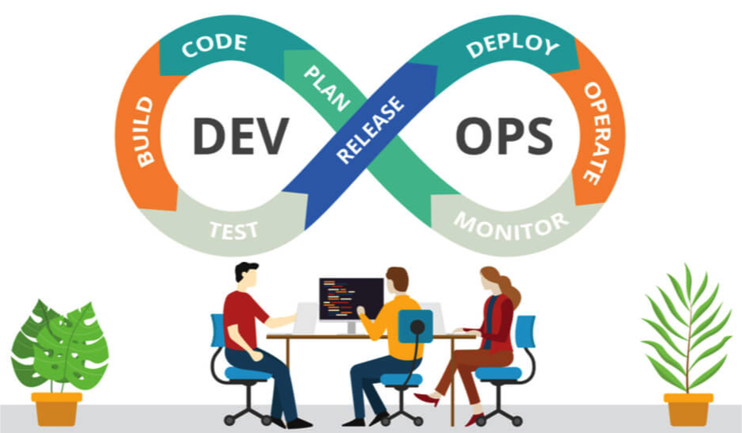

# Implantação de um Pipeline DevOps

Esse material visa apresentar a ferramenta [TeamCity](https://www.jetbrains.com/teamcity/?source=google&medium=cpc&campaign=12704032062&gclid=Cj0KCQjwrJOMBhCZARIsAGEd4VEvmhLzrxXgIWnJJaBqSzEqfn_0Uv2Wb-uzBLFEWgfIOyCW-6GD5OEaAjL2EALw_wcB), cujo o objetivo implantar um Pipeline de desenvolvimento com Continuos Integration (CI) e Continuos Delivery (CD).

> Autor: **[Luciano de Aguiar Monteiro](https://github.com/lucianoaguiarthe)**
> 
> E-mail: luciano@lucianoaguiar.com.br
> 
> Autor: **[Anderson Lima](https://github.com/lucianoaguiarthe)**
> 
> E-mail: andclima@gmail.com

## Sumário

1. [Configuração Máquina Virtual](manuscript/pipeline-cicd.md)
2. [Instalação Docker](manuscript/Instalacao-Docker.md)
3. [Criação e Configuração do Container](manuscript/Configuracao-Docker.md)
4. [Disponibilização Docker Hub](manuscript/Configuracao-DockerHub.md)