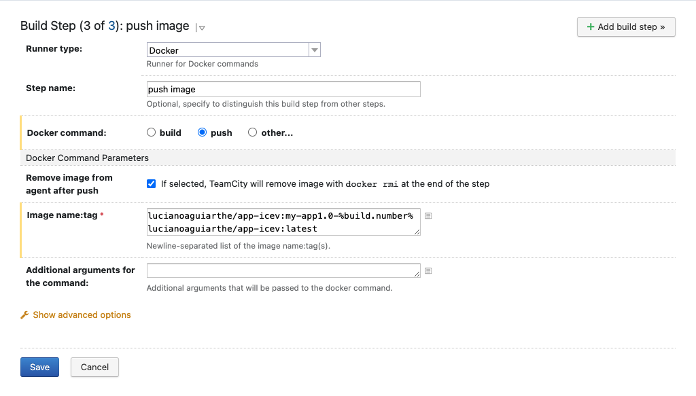
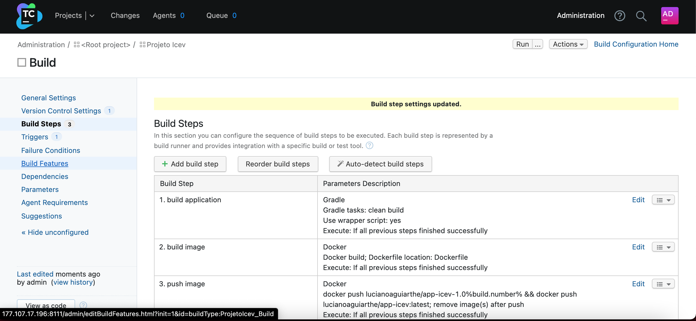

# Container

O c.

## COMANDOS BÁSICOS DOCKER

A c.

### CRIAÇÃO DE UM CONTAINER

Para criar um container execute o seguinte comando:
 

O resulado do comando é apresentado na imagem abaixo, no qual foi realizado o download no Docker Hub da imagem do Debian e gerado um container com o nome icev

Explicando melhor os parâmetros do comando de criação do container:

* <b>run</b> é utilizado para rodar um comando em um novo container;
* O parâmetro <b>-d</b> (deattaached) é para ser utilizado caso você não queira se conectar no container no momento de sua criação;
* O parâmetro <b>-i</b> (--interactive na sua forma estendida) é utilizado para deixar a entrada de dados ao container aberta, caso você não esteja conectado (attached) no container em questão;
* O parâmetro <b>-t</b> é utilizado para alocar um pseudo-tty para o container. Assim, podemos interagir com o interpretador de comando passando comandos para o /bin/bash, da mesma forma que usamos um terminal e uma máquina virtual ou máquina física;
* O parâmetro <b>-p</b> realiza o mapeamento das portas entre o Sistema Operacional hospedeiro e o container;
* <b>--name</b> é o nome que será atribuído ao container;
* <b>--hostname</b> é o nome de rede que será atribuído ao container.

### ACESSANDO O CONTAINER

Após a instalação do container se faz necessário acessá-lo para atualizar o container o instalar a aplicação, o comando  responsável por isso é o docker attach, conforme descrito abaixo:

Observe que após a execução do comando o prompt do Sistema Operacional modificou, isso quer dizer que você passou a acessar o container.

Para sair do container sem finalizar digite <b>ctrl + p + q</b>, se digitar exit o mesmo será finalizado

### INICIANDO OU PARANDO CONTAINER

Os comandos docker start ou docker stop são utilizado para iniciar ou parar a execução do container, devendo passar por parâmetros o nome do mesmo.

### CONSULTANDO AS IMAGENS DISPONÍVEIS

Caso o administrador do sistema necessite consultar as imagens que já foram baixadas no computador hospedeiro é necessário executar o comando docker images, conforme observado abaixo:

### EXCLUSÃO DE CONTAINER

Quando não existe mais necessidade de um container criado o administrador do sistema finaliza o mesmo com o docker stop, todavia os arquivos ainda ficam residindo no sistema, para apagar este container deve ser usado o comando docker rm nome_do_container, o mesmo só será aceito se o container já estiver desligado.

### EXCLUSÃO DE IMAGEM

O docker rmi é utilizado quando o administrador do container deseja remover as imagens baixadas no repositório local, na imagem abaixo apresenta o comando de remoção da imagem nginx.

### VISUALIZAÇÃO DOS CONTAINER EM EXECUÇÃO

Ao longo da administração de sistemas com docker se faz necessário visualizar os containers que estão em execução no momento, com este objetivo pode-se utilizar o comando docker ps, a figura abaixo apresenta um ambiente em que estão executando dois containers com o nome debian e ubuntu.

### CRIANDO UMA NOVA IMAGEM

Ao criar um container o administrador do sistema pode instalar aplicações neste, e caso haja necessita salvar a imagens para reutilizar este container já preparado, para isso pode realizar o commit com o comando docker commit imagem_alterada nova_imagem, a imagem abaixo apresenta um exemplo, onde é criado uma nova imagem img-icev a partir do container icev, logo em seguida é exibido a lista de imagens do repositório local já com a nova criada

[Início](/README.md)