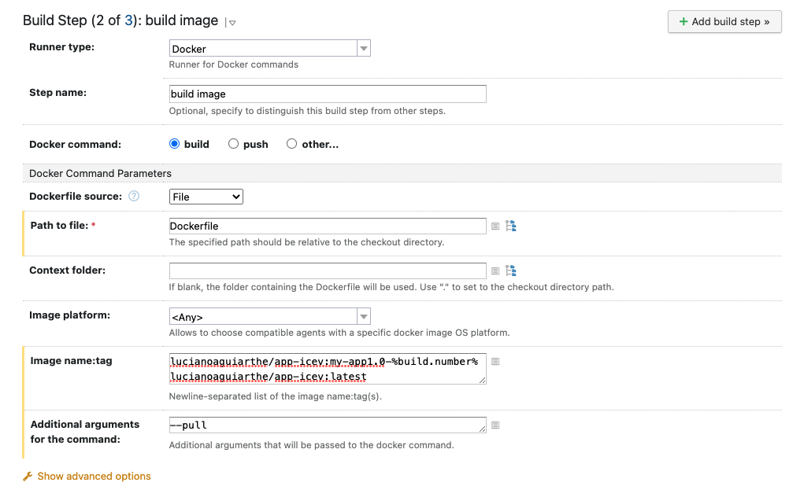
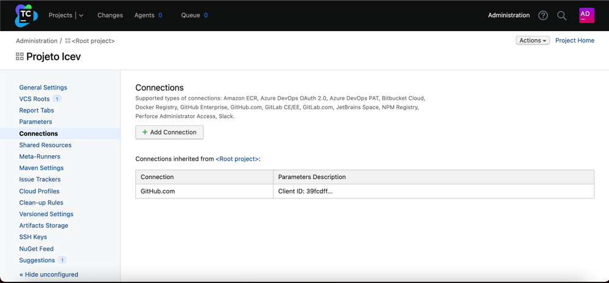
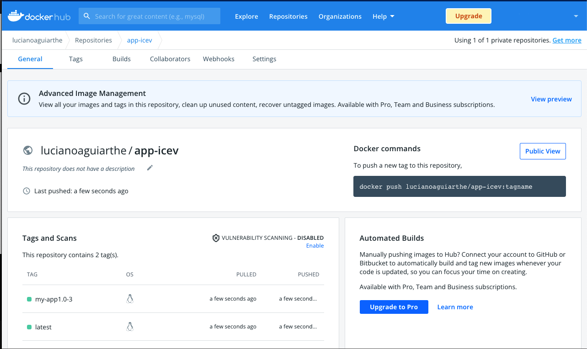

# Pipeline de Desenvolvimento

O Pipeline de Desenvolvimento é uma esteira de produdção de software automatizada com ferramentas utilizando práticas como <b>Continuous Integration</b> em que os desenvolvedores enviam os seus códigos em um repositório único, visando um fluxo automatizado e a <b>Continuous Delivery</b> que tem como objetivo implantar automática as alterações ocorridas no repositório em ambiente de produção. Diversas ferramentas tem o objetivo de disponibilizar este ambiente como <a href=""https://www.jenkins.io/">Jenkins</a>, e o TeamCity que é o foco deste material.

## IMPLANTAÇÃO DO AMBIENTE

Para implantação do ambiente como TeamCity, é possível adotar alguns modelos, utilizando a própia nuvem da desenvolvedora ou realizando uma instalação on premise, desta forma pode-se instalar em containers ou direto no servidores.

### Instalação do Servidor TeamCity

O modelo de instalação que irei apresentar é rodando o Servidor TeamCity em containers, para isso existe o pré-requisito da instalação do Docker, não irei abordar esta parte no material, podendo ser encontrado toda a informação referente a instalação do docker neste <a href="https://docs.docker.com/engine/install/debian/">link</a>

Após a instalação basta criar o container do Servidor TeamCity com o comando descrito a seguir:

<blockquote>
docker run -v team_city_data:/data/teamcity_server/datadir -v team_city_logs:/opt/teamcity/logs -p 8111:8111 -d jetbrains/teamcity-server
</blockquote>

Ao concluir o download da imagem docker teamcity-server, será realizado a criação do container e você deverá acessar o servidor pelo seguinte endereço: https://ip_do_servidor:8111

### Configuração do Servidor TeamCity

O primeiro acesso irá apresentar a imagem descrita a seguir e fazer uma sequência de perguntas para a configuração.</>

O Servidro TeamCity suporta alguns tipos de banco de dados como MySql e Oracle, todavia neste exemplo irei utilizar o banco de dados interno sugerido pelo instalador <b>Internal HSQLDB</b>

Será apresentado a licença de uso que você deverá aceitar para continuar a instalação.

É necessário ainda criar o usuário administrador do ambiente.

Após concluir a instalação você deverá logar na aplicação no qual será solicitado para criar seu primeiro projeto.

Em nosso laboratório iremos utilizar um código de exemplo que realiza o download de uma imagem docker e irá publicar no docker hub, o código encontra neste <a href="https://github.com/lucianoaguiarthe/projeto-icev">link</a>

Para isso deveremos conectar o TeamCity ao GitHub no devemos adicionar uma conexão e cadastrar as credenciais de acesso solicitadas na janela descrita abaixo:

Ao concluir a configuração volte para a tela inicial e clique no botão criar projeto.

Desta forma será exibido o github e voce conseguirá visualizar todos os repositórios da conta cadastrada, selecionando o repositório onde está seu código.

Em seguida será solicitado o nome da Build que você está construindo, atribua um nome e clique no botão Proceed.

A ferramenta irá realizar uma análise do código e auto detectar uma sequência de Builds, contudo iremos escolher configurar os passos do Build Manualmente.

O primeiro Build iremos construir a aplicação, em <b>Runner type</b> escolha Gradle, atribua um nome em <b>Step name</b> e em <b>Gradle Task</b> digite "clean build", por último salve as configurações.

Crie mais um passo,em <b>Runner type</b> escolha "Docker", atribua um nome em <b>Step name</b>, em <b>Path to file</b> aponte para o "Dockerfile" e em <b>Image name:tag</b> descreva o nome das imagens e suas tags, que você irá salvar no DockerHub, como por exemplo projeto-icev/demo-app:myapp-1.0 acrescentando o parâmetro build.number no final do nome da imagem e finalmente salve a configuração do passo.

Crie mais um passo que irá enviar a imagem ao DockeHub, escolha em <b>Runner type</b> a opção "Docker", atribua um nome em <b>Step name</b>, em <b>Docker command</b> marque "push", em <b>Image name:tag</b>, use os mesmos nome das imagens criadas no passo anterior e salve as configurações

Desta forma criamos um compilação completa do projeto em 3 (três) etapas.

Para que o TeamCity possa enviar a imagem compilada para o DockerHub é necessário configurar uma conexão, para isso vá em JavaApp e na lista de opções a esquerda clique em <b>Connections</b>.

Na tela seguinte clique em <b>Add Connection</b> e escolha a opção Docker Registry

Coloque o seu usuário e senha criado durante o cadastro no DockerHub, teste a conexão e salve</b>

Vamos conectar o nosso projeto a conexão que criamos para o DockerHub, para isso volte para a tela do seu projeto e clique em <b>Build Features</b>, clique em <b>Add Build Features</b>, selecione <b>Docker Support</b>, escolha "Docker Registry" na opção <b>Select Repository</b>, clique em <b>Add</b> e salve as configurações.</b>

Para executarmos as compilações se faz necessário o uso de agentes, que atualmente não existe nenhum agente configurado, o agente pode rodar em um docker ou pode-se baixar seus binários para executar em um server linux

Para instalarmos o agente em um Server Linux se faz necessário a instalação do Java, conforme comandos apresentados nas telas seguintes:

No Server que está instalado o agente abra o arquivo "<TeamCity Agent Home>/conf/buildAgent.propertie" e altere o parâmetro <b>serverUrl</b>, apontando para o servidor que está instalado o TeamCity.

Acesse a pasta "conf" onde está instalado o agente, e inicialize o serviço conforme figura abaixo:

Após inicializar o agente, será exibido o seu IP no painel, no qual você deverá autorizar a conexão

Ao concluir a conexão do agente já é possível executar o pipeline do ambiente

Se toda a configuração realizada estiver correta, será exibido todas as fases do build em execução

Para confirmar se a compilação e o pipeline foi executado corretamente, basta verificar o seu DockerHub, com a imagem criada.

[Início](/README.md)